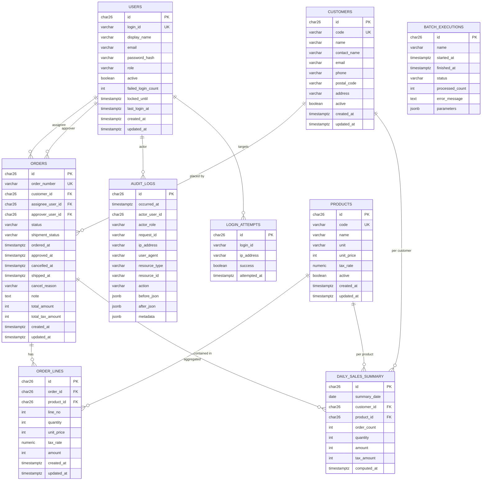

# DB スキーマ設計: 中小卸売業向け受発注管理システム

- DBMS: PostgreSQL 16
- ORM: Prisma（マイグレーションは `prisma migrate`）
- 文字コード: UTF-8
- タイムゾーン: DB 内は UTC 保存、表示層で JST へ変換
- 命名規約: テーブル・列は `snake_case`（Prisma の `@@map` / `@map` で Prisma 側 camelCase にマップ）
- ID: 全テーブル ULID 文字列 (`CHAR(26)`) を主キーに採用。プレフィックス付き（例: `ord_01H...`）で可読性を確保
- タイムスタンプ: `created_at`, `updated_at` を原則全テーブルに持たせる（`TIMESTAMPTZ`）

---

## 1. ER 図（Mermaid）

---

## 2. テーブル定義

### 2.1 `users`

| 列 | 型 | NULL | デフォルト | 備考 |
|----|------|------|---------|------|
| `id`                  | char(26)    | NO | -          | PK (ULID, `u_` prefix) |
| `login_id`            | varchar(64) | NO | -          | UNIQUE。ログイン識別子 |
| `display_name`        | varchar(128)| NO | -          | 表示名 |
| `email`               | varchar(256)| YES| NULL       | 任意 |
| `password_hash`       | varchar(256)| NO | -          | argon2id ハッシュ |
| `role`                | varchar(16) | NO | -          | `admin` / `orderer` / `sales` / `viewer` |
| `active`              | boolean     | NO | TRUE       | 論理削除用 |
| `failed_login_count`  | integer     | NO | 0          | 連続失敗数 |
| `locked_until`        | timestamptz | YES| NULL       | ロック解除時刻 |
| `last_login_at`       | timestamptz | YES| NULL       | |
| `created_at`          | timestamptz | NO | now()      | |
| `updated_at`          | timestamptz | NO | now()      | トリガまたはアプリで更新 |

インデックス:
- `UNIQUE (login_id)`
- `INDEX (role) WHERE active = true`

### 2.2 `customers`

| 列 | 型 | NULL | デフォルト | 備考 |
|----|------|------|---------|------|
| `id`            | char(26)     | NO | - | PK (`cus_` prefix) |
| `code`          | varchar(32)  | NO | - | UNIQUE。業務キー |
| `name`          | varchar(256) | NO | - | |
| `contact_name`  | varchar(128) | YES| NULL | |
| `email`         | varchar(256) | YES| NULL | |
| `phone`         | varchar(32)  | YES| NULL | |
| `postal_code`   | varchar(16)  | YES| NULL | |
| `address`       | varchar(512) | YES| NULL | |
| `active`        | boolean      | NO | TRUE | 論理削除 |
| `created_at`    | timestamptz  | NO | now() | |
| `updated_at`    | timestamptz  | NO | now() | |

インデックス:
- `UNIQUE (code)`
- `INDEX (name)` （前方一致検索用、あるいは pg_trgm を必要に応じて追加）
- `INDEX (active)`

### 2.3 `products`

| 列 | 型 | NULL | デフォルト | 備考 |
|----|------|------|---------|------|
| `id`          | char(26)     | NO | - | PK (`prd_` prefix) |
| `code`        | varchar(32)  | NO | - | UNIQUE |
| `name`        | varchar(256) | NO | - | |
| `unit`        | varchar(16)  | NO | - | 単位（箱 / 個 等） |
| `unit_price`  | integer      | NO | - | 税抜単価（円、整数） |
| `tax_rate`    | numeric(4,3) | NO | 0.100 | 0.000〜0.999 |
| `active`      | boolean      | NO | TRUE | 論理削除 |
| `created_at`  | timestamptz  | NO | now() | |
| `updated_at`  | timestamptz  | NO | now() | |

インデックス:
- `UNIQUE (code)`
- `INDEX (name)`
- `INDEX (active)`

### 2.4 `orders`

| 列 | 型 | NULL | デフォルト | 備考 |
|----|------|------|---------|------|
| `id`                | char(26)     | NO | - | PK (`ord_` prefix) |
| `order_number`      | varchar(32)  | NO | - | UNIQUE。業務番号（`YYYY-0000001` 形式をアプリで採番） |
| `customer_id`       | char(26)     | NO | - | FK → `customers.id` |
| `assignee_user_id`  | char(26)     | NO | - | FK → `users.id`（営業担当＝登録者） |
| `approver_user_id`  | char(26)     | YES| NULL | FK → `users.id` |
| `status`            | varchar(16)  | NO | 'draft' | `draft` / `approved` / `cancelled` |
| `shipment_status`   | varchar(16)  | NO | 'pending' | `pending` / `shipped` / `cancelled` |
| `ordered_at`        | timestamptz  | NO | now() | 受注日時 |
| `approved_at`       | timestamptz  | YES| NULL | |
| `cancelled_at`      | timestamptz  | YES| NULL | |
| `shipped_at`        | timestamptz  | YES| NULL | |
| `cancel_reason`     | varchar(256) | YES| NULL | |
| `note`              | text         | YES| NULL | |
| `total_amount`      | integer      | NO | 0 | 税込合計（円） |
| `total_tax_amount`  | integer      | NO | 0 | 税額合計 |
| `created_at`        | timestamptz  | NO | now() | |
| `updated_at`        | timestamptz  | NO | now() | |

インデックス:
- `UNIQUE (order_number)`
- `INDEX (customer_id, ordered_at DESC)`
- `INDEX (status, ordered_at DESC)`
- `INDEX (shipment_status, ordered_at DESC)`
- `INDEX (assignee_user_id, ordered_at DESC)`
- `INDEX (ordered_at DESC)`  -- 期間検索用

CHECK 制約:
- `status IN ('draft','approved','cancelled')`
- `shipment_status IN ('pending','shipped','cancelled')`
- `total_amount >= 0`

### 2.5 `order_lines`

| 列 | 型 | NULL | デフォルト | 備考 |
|----|------|------|---------|------|
| `id`          | char(26)     | NO | - | PK (`oli_` prefix) |
| `order_id`    | char(26)     | NO | - | FK → `orders.id` ON DELETE RESTRICT |
| `product_id`  | char(26)     | NO | - | FK → `products.id` ON DELETE RESTRICT |
| `line_no`     | integer      | NO | - | 1 始まり、`order_id` 内で連番 |
| `quantity`    | integer      | NO | - | 1 以上 |
| `unit_price`  | integer      | NO | - | 発注時点の税抜単価（スナップショット） |
| `tax_rate`    | numeric(4,3) | NO | - | 発注時点の税率（スナップショット） |
| `amount`      | integer      | NO | - | `floor(quantity * unit_price * (1 + tax_rate))` を保存 |
| `created_at`  | timestamptz  | NO | now() | |
| `updated_at`  | timestamptz  | NO | now() | |

インデックス:
- `UNIQUE (order_id, line_no)`
- `INDEX (product_id)`
- `INDEX (order_id)`

CHECK 制約:
- `quantity > 0`
- `unit_price >= 0`
- `amount >= 0`

備考: 商品情報はスナップショット保持（後から商品マスタを変えても履歴が壊れない）。

### 2.6 `daily_sales_summary`

日次バッチで生成する集計テーブル。閲覧専用。

| 列 | 型 | NULL | デフォルト | 備考 |
|----|------|------|---------|------|
| `id`           | char(26)    | NO | - | PK |
| `summary_date` | date        | NO | - | 集計対象日 (JST) |
| `customer_id`  | char(26)    | NO | - | FK → `customers.id` |
| `product_id`   | char(26)    | NO | - | FK → `products.id` |
| `order_count`  | integer     | NO | 0 | 対象日の受注数（承認済み・キャンセル除く） |
| `quantity`     | integer     | NO | 0 | 合計数量 |
| `amount`       | integer     | NO | 0 | 税込合計 |
| `tax_amount`   | integer     | NO | 0 | 税額合計 |
| `computed_at`  | timestamptz | NO | now() | 最後に計算した時刻 |

インデックス:
- `UNIQUE (summary_date, customer_id, product_id)` ← UPSERT キー
- `INDEX (summary_date)`
- `INDEX (customer_id, summary_date)`
- `INDEX (product_id, summary_date)`

### 2.7 `audit_logs`

追記専用。アプリ DB ユーザーには `INSERT` のみ許可し、管理者ロール接続のみ SELECT 可能にする。

| 列 | 型 | NULL | デフォルト | 備考 |
|----|------|------|---------|------|
| `id`             | char(26)    | NO | - | PK (`log_` prefix) |
| `occurred_at`    | timestamptz | NO | now() | |
| `actor_user_id`  | char(26)    | YES| NULL | 未認証時は NULL |
| `actor_role`     | varchar(16) | YES| NULL | |
| `request_id`     | varchar(64) | YES| NULL | 相関 ID |
| `ip_address`     | varchar(64) | YES| NULL | IPv6 考慮 |
| `user_agent`     | varchar(512)| YES| NULL | |
| `resource_type`  | varchar(32) | NO | - | `order`/`customer`/`product`/`user`/`csv`/`auth` |
| `resource_id`    | varchar(64) | YES| NULL | CSV 取込などリソース単位でないものは NULL |
| `action`         | varchar(32) | NO | - | `create`/`update`/`delete`/`approve`/`cancel`/`ship`/`import`/`login`/`logout` |
| `before_json`    | jsonb       | YES| NULL | 変更前 |
| `after_json`     | jsonb       | YES| NULL | 変更後 |
| `metadata`       | jsonb       | YES| NULL | 追加情報 |

インデックス:
- `INDEX (occurred_at DESC)`
- `INDEX (resource_type, resource_id, occurred_at DESC)`
- `INDEX (actor_user_id, occurred_at DESC)`
- `INDEX (action, occurred_at DESC)`

将来のパーティショニングを見越し、`occurred_at` は NOT NULL かつ必ず参照クエリで期間指定する API 設計とする。

### 2.8 `batch_executions`

バッチ実行履歴。

| 列 | 型 | NULL | デフォルト | 備考 |
|----|------|------|---------|------|
| `id`              | char(26)    | NO | - | PK |
| `name`            | varchar(64) | NO | - | `daily-summary` など |
| `started_at`      | timestamptz | NO | now() | |
| `finished_at`     | timestamptz | YES| NULL | |
| `status`          | varchar(16) | NO | 'running' | `running` / `succeeded` / `failed` |
| `processed_count` | integer     | NO | 0 | |
| `error_message`   | text        | YES| NULL | |
| `parameters`      | jsonb       | YES| NULL | CLI 引数 |

インデックス:
- `INDEX (name, started_at DESC)`

### 2.9 `login_attempts`

ログイン試行ログ（監査ログと別に分離し、パフォーマンスと可観測性を確保）。

| 列 | 型 | NULL | デフォルト | 備考 |
|----|------|------|---------|------|
| `id`           | char(26)    | NO | - | PK |
| `login_id`     | varchar(64) | NO | - | |
| `ip_address`   | varchar(64) | YES| NULL | |
| `success`      | boolean     | NO | - | |
| `attempted_at` | timestamptz | NO | now() | |

インデックス:
- `INDEX (login_id, attempted_at DESC)`
- `INDEX (attempted_at DESC)`

---

## 3. 列挙値まとめ

| カラム | 値 |
|--------|----|
| `users.role`            | `admin` / `orderer` / `sales` / `viewer` |
| `orders.status`         | `draft` / `approved` / `cancelled` |
| `orders.shipment_status`| `pending` / `shipped` / `cancelled` |
| `audit_logs.action`     | `create` / `update` / `delete` / `approve` / `cancel` / `ship` / `import` / `login` / `logout` |
| `batch_executions.status` | `running` / `succeeded` / `failed` |

Prisma 側は TypeScript Enum として表現するが、DB 上は `varchar` + `CHECK` 制約で運用する（値追加時にマイグレーションを軽く保つため）。

---

## 4. トランザクション境界とスナップショット方針

- 受注登録・承認・キャンセル・出荷ステータス更新は、すべて**単一トランザクション**で `orders` / `order_lines` / `audit_logs` を書き込む。
- `order_lines` は商品マスタの値を**スナップショット**で保持する（`unit_price`, `tax_rate`, `amount`）。これにより商品マスタの事後更新が既存受注の金額を変えない。
- 受注合計（`orders.total_amount`, `total_tax_amount`）は Service 層で計算し永続化する。集計バッチはこの値を参照する（= 実質ディノーマライズによる高速化）。

---

## 5. マイグレーション運用

- Prisma Migrate を標準運用。`apps/api/prisma/migrations/` にタイムスタンプ付きでマイグレーションを積む。
- `seed.ts` で管理者ユーザー 1 名、各ロールのサンプルユーザー、取引先・商品数件、下書き受注 1 件を投入。
- 本番運用では `prisma migrate deploy` のみを許可し、`dev`/`reset` は CI/開発環境限定。

---

## 6. インデックス設計の根拠（抜粋）

- `orders (ordered_at DESC)`: 受注一覧のデフォルトソート。
- `orders (status, ordered_at DESC)`: 「未承認の受注」「承認済みかつ未出荷」画面。
- `orders (customer_id, ordered_at DESC)`: 取引先別の受注履歴表示。
- `order_lines (product_id)`: 集計バッチで「商品別」を走らせる時。
- `daily_sales_summary (summary_date, customer_id, product_id)`: UPSERT の一意制約そのもの。
- `audit_logs (resource_type, resource_id, occurred_at DESC)`: 「この受注の変更履歴」閲覧。

受注一覧の性能要件（100 名同時利用・2 秒以内）は、上記インデックス + ページング（`LIMIT/OFFSET`、最大 200 件）で想定件数（年間数万件〜数十万件想定）までカバー可能。桁が上がる場合はカーソルページングへの移行を検討する。
